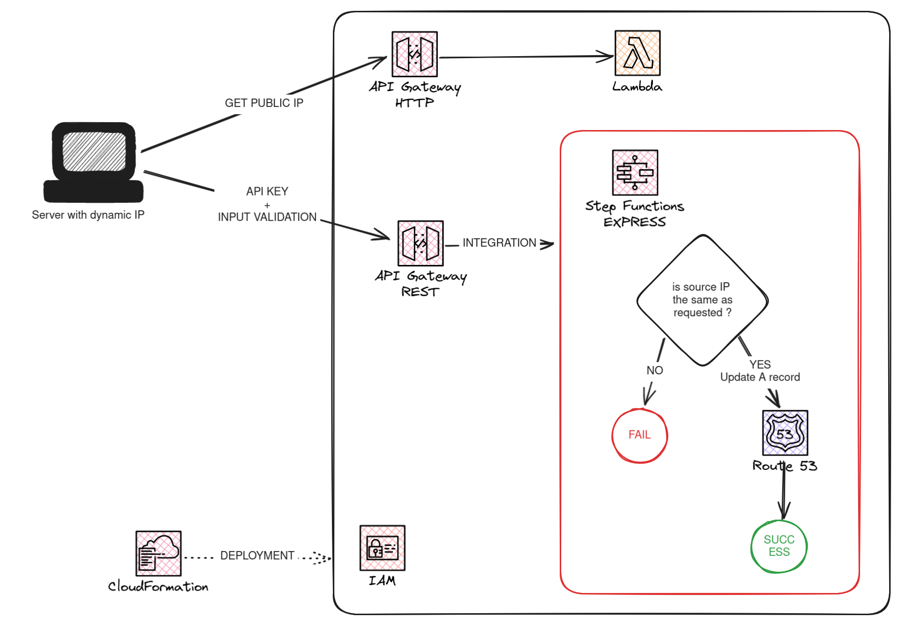

# Auto-update A record with latest IP

No more use a dynDNS service to update DNS when your IP changes!

This repo rely on an AWS CDK stack to update your A record in route 53 with an HTTP API. It also provides a script to automatically call this API whenever your IP changes.

... and it is [(almost) free](#estimated-cost)!



## Prerequisites

- [`Node.js`](https://nodejs.org/en/download)
- An AWS account and credentials (to deploy the CDK stack)
- An hosted zone in AWS Route53, i.e. a domain that you want to point to your own server IP.

## Get started

1. Install the project

   ```sh
   npm install
   ```

2. Copy `.env.example` to `.env` and fill the values

   ```sh
   cp .env.example .env
   ```

   - `REGION`: AWS region to deploy your stack
   - `DOMAIN_NAME`: name (subdomain.domain.extension) of the A record you want to keep updated
   - `HOSTED_ZONE_ID`: Id of the hosted zone you own
   - `FETCH_IP_API_PATH`: Path of the API to get your current public IP on Internet. Must start with "/"
   - `API_INTEGRATION_PATH`: Path of the API to update the A record. Must start with "/"

3. Deploy your stack

   ```sh
   npm run deploy
   ```

   > If you need to use an AWS profile, you can run `AWS_PROFILE=my-profile npm run deploy` instead.

   At the end, you are asked if you want to add a cron job to automatically call the API to update your IP. Answer yes only if you are deploying from the server which will need the update.

4. Make it work!

   If you are not deploying from your server, you will need to:

   - copy the folder `scripts/domain-auto-update` (scripts and `*.cfg` files) to the target server
   - create a cron job to run the script regularly, for instance:
     `0 1 * * * /home/my-user/domain-auto-update/update-ip.sh`

5. Make it more secure!

   The API key stored in an unencrypted file. Consider using a password manager or at least encrypt your session data.

## Advanced configuration

You can edit the stack props in [`bin/auto-update-ip-aws.ts`](./bin/auto-update-ip-aws.ts):

- `fetchIpApi` (defined by default): if not defined, you will need to call a third party API to get your IP address, like https://api.ipify.org?format=json or https://ipinfo.io/ip.
- `apiIntegration` (defined by default): if not defined, you will need to call the state machine directly through the AWS API. But in this case, it is simpler to call the route53 ApI directly!
- `user` (not defined by default): if defined, it will create an IAM user allowed to start the state machine synchronously. Not recommended.

Want more options? Feel free to contribute!

## General commands

- `npm run build` compile typescript to js
- `npm run watch` watch for changes and compile
- `npm run test` perform the jest unit tests
- `npx cdk deploy` deploy this stack to your default AWS account/region
- `npx cdk diff` compare deployed stack with current state
- `npx cdk synth` emits the synthesized CloudFormation template

## Estimated cost

The deployed stack uses AWS resources at really low cost:

- Lambda: ~ \$0.00005 / month = 31 days x 1000 milliseconds x $0.0000000017 (architecture ARM, memory: 128 MB, region eu-west-1, Jan. 2024)
- Step Functions: ~ \$0.033 / month = 31 days x (\$0.000001 (price per request, Jan. 2024) + 1000 milliseconds x 64 MB x \$0.00001667 )
- CloudWatch: Free tier = 6 months x 31 days x (2 kB (Step Functions) + 500 B (Lambda)) = 0.5 MB < 5 GB of free tier
- API Gateway V1: ~ \$0.00003 = 31 x 3.50/million requests. NB: free tier the first year
- API Gateway V2: ~ \$0.0001 = 31 x 1.11/million requests. NB: free tier the first year
- Route 53 : ~ \$0.00001 / month = 31 queries (if IP changes every day) x $0.40 per million queries
- CloudFormation : free
- IAM: free

=> TOTAL: < 0.5$ per year!

> NB: you need to add the domain name cost (~\$12 per year (depending on the name chosen) + $0.50 per hosted zone per month).
